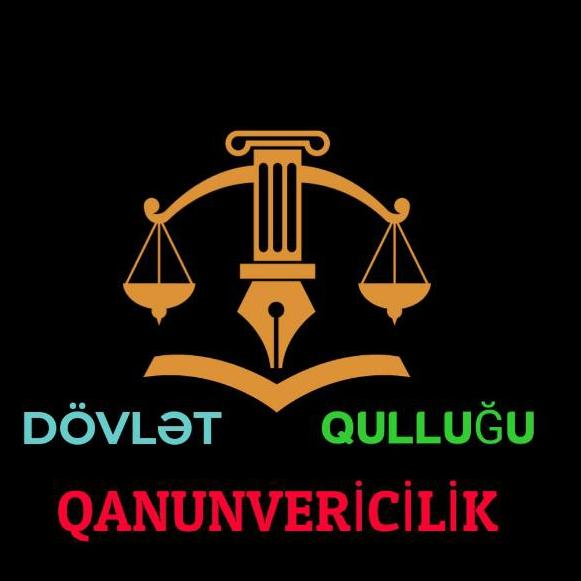

<!DOCTYPE html>
<html lang="az">
<head>
    <meta charset="UTF-8">
    <meta name="viewport" content="width=device-width, initial-scale=1.0">
    <title>Dövlət Qulluğu - Linklər və Qruplar</title>
    
</head>
<body>

    

        
        
        <h1>DÖVLƏT QULLUĞU</h1>
        
Resurslar, Qruplar və Kanallar

        
        
Ümumi Resurslar

        <a class="btn whatsapp" href="https://whatsapp.com/channel/0029VbCALY9BPzjZ5x9GrH3f" target="_blank">Dövlət Qulluğu WhatsApp Kanalımız</a>

        
Qanunvericilik

        <a class="btn whatsapp" href="https://chat.whatsapp.com/DfoRdfktXVS5sK0SSNiRzQ" target="_blank">Qanunvericilik WhatsApp Qrupumuz</a>
        <a class="btn whatsapp" href="https://whatsapp.com/channel/0029VbCuISL0QeaoiWCEka1S" target="_blank">Qanunvericilik WhatsApp Kanalımız</a>
        <a class="btn telegram" href="https://t.me/PH_Qanunvericilik" target="_blank">Qanunvericilik Telegram Kanalımız</a>
        <a class="btn telegram" href="https://t.me/PH_Qanunvericiliik" target="_blank">Qanunvericilik Telegram Qrupumuz</a>
        
        
İnformatika

        <a class="btn telegram" href="https://t.me/infoPHJ" target="_blank">İnformatika Telegram Qrupumuz</a>
        
        
Müsahibə

        <a class="btn whatsapp" href="https://chat.whatsapp.com/GvlZG96GrSk7D2YWlXgp6t?s=cl&p=a&mlu=4" target="_blank">Müsahibə WhatsApp Qrupumuz</a>
        <a class="btn telegram" href="https://t.me/ph_musahibe" target="_blank">Müsahibə Telegram Qrupumuz</a>
        
        
Azərbaycan Dili

        <a class="btn telegram" href="https://t.me/azerbaycan_dili_PH" target="_blank">Azərbaycan Dili Telegram Qrupu</a>
        
        
Sosial Şəbəkə

        <a class="btn instagram" href="https://www.instagram.com/dovletqulluguqanunvericilik?utm_source=qr&igsh=MXVldWV0OTIyaXp5eQ==" target="_blank">Instagram Hesabımız</a>
    

</body>
</html>

